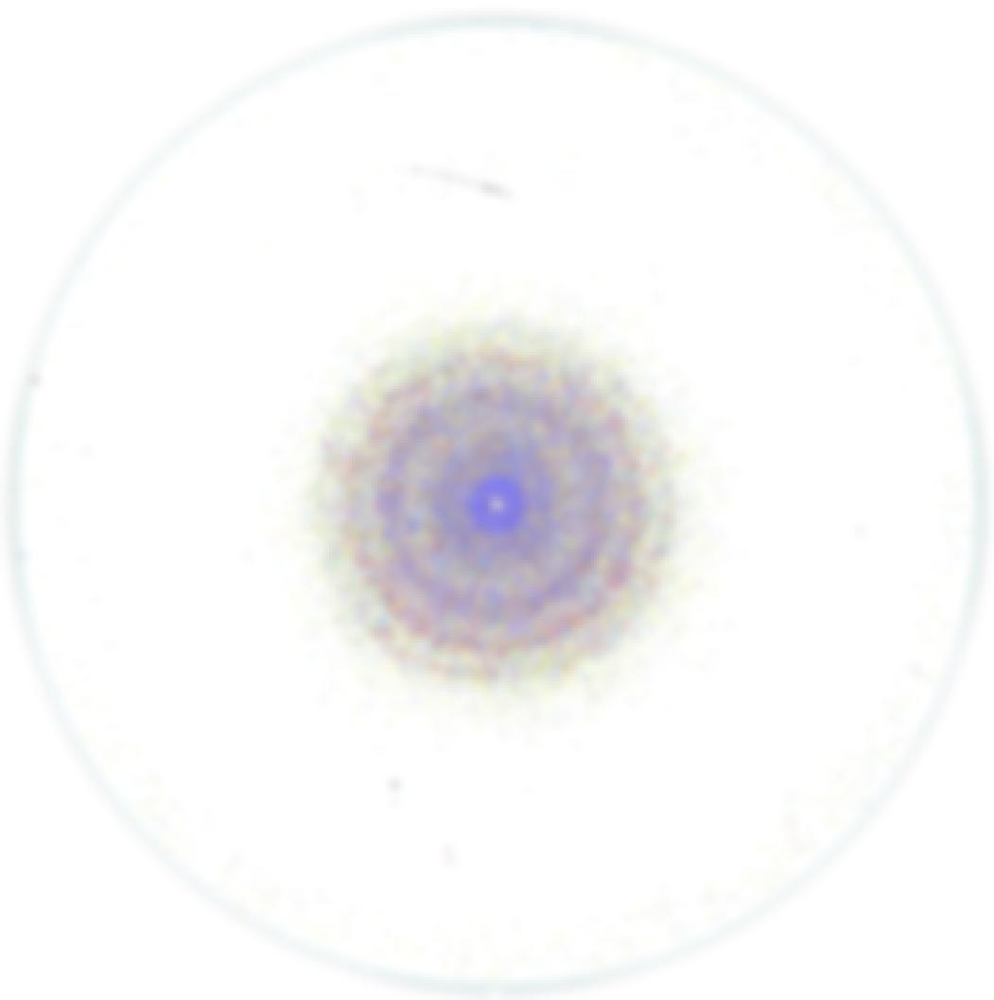
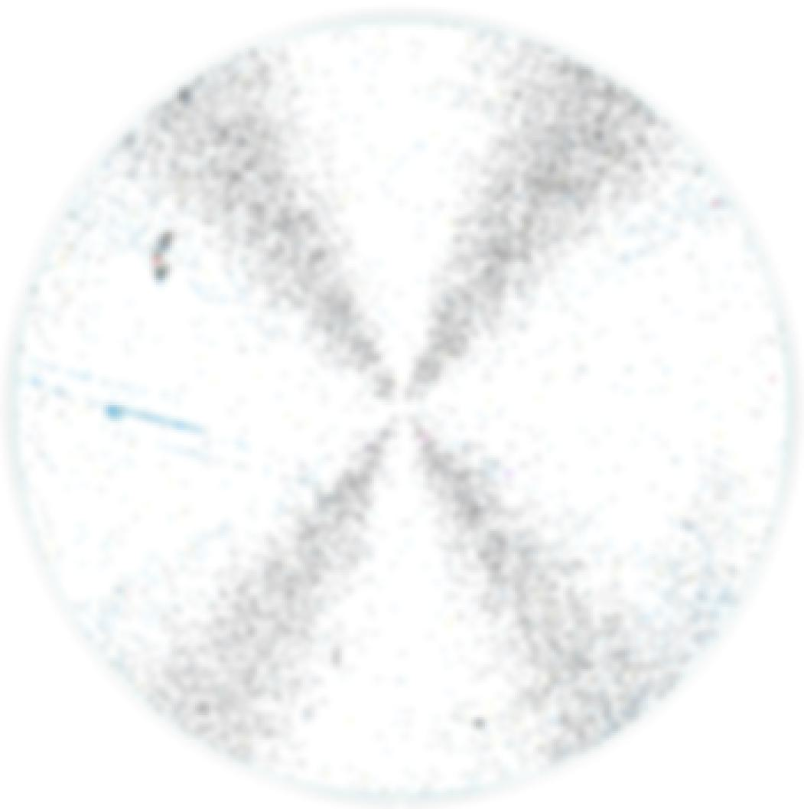
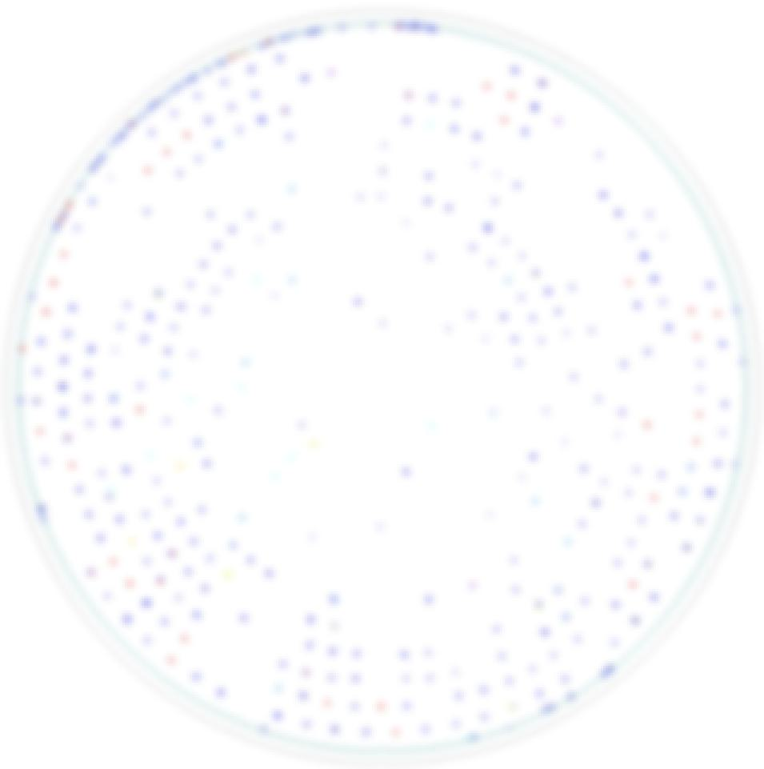
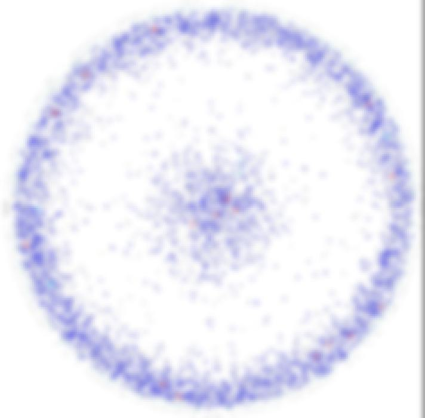
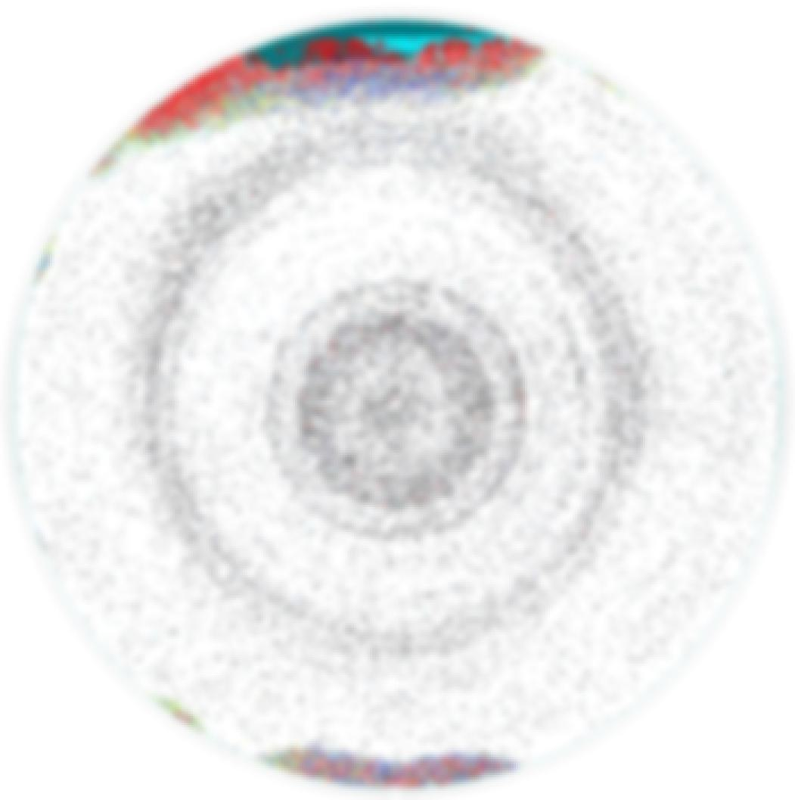
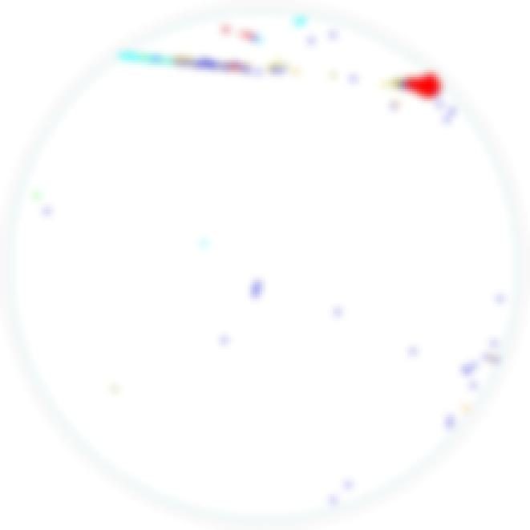

# ReWafer-BinaryDefect

## Introduction

## Introduction

`ReWafer-BinaryDefect` is an AI system designed for binary defect detection in regenerated wafers, and it has been successfully implemented in the production process of a publicly listed company. Utilizing deep learning technology, this system automatically determines if a wafer has defects with an accuracy of **92%**, significantly enhancing production efficiency and reducing labor costs.

## Background

As semiconductor manufacturing demands increasingly precise defect detection, traditional manual inspection methods fall short due to their inefficiency and susceptibility to errors. `ReWafer-BinaryDefect` addresses these challenges by providing a high-efficiency, accurate automated defect detection solution.

- **Challenges**:
  - Manual inspections are subjective and error-prone.
  - Traditional methods fail to meet the high precision requirements of modern production.

- **Solution**:
  - Develop an AI system for binary defect detection with high accuracy.
  - Collect and label data with the help of project personnel to improve model performance.

- **Results and Future Plans**:
  - The system has been successfully deployed with 92% accuracy, greatly reducing the need for manual intervention.
  - Future plans include expanding the system to detect defect patterns for broader application.

## Quickstart

To get started with `ReWafer-BinaryDefect`, follow these steps:

1. **Clone the Repository**:
    ```sh
    git clone https://github.com/hungcheng-chen/PCB-RouteOpt.git
    cd rewafer_binarydefect
    ```

2. **Install Dependencies**:
    ```sh
    pip install -r requirements.txt
    ```

3. **Training**: Begin training with the following command. You can adjust command-line parameters as needed:
    ```bash
    python train.py --data_dir data/binary --model_name convnext_tiny.fb_in22k --batch_size 128 --epochs 30 --lr 1e-4
    ```

4. **Validation**: Evaluate model performance during or after training with this command:
    ```bash
    python val.py --test --data_dir data/binary --model_name convnext_tiny.fb_in22k --load_model runs/.../best_model.pt
    ```

5. **Inference**: Use this command to detect defects in new wafer images:
    ```bash
    python test.py --test --model_name convnext_tiny.fb_in22k --load_model runs/.../best_model.pt --image_path .../xxx.png
    ```

## Example

Due to confidentiality reasons, we cannot provide real wafer images. For this project, we use the `convnext_tiny` model architecture and employ pre-trained weights from the ImageNet-22k dataset provided by `timm` for transfer learning.

<table align="center">
<tr>
    <td></td>
    <td></td>
    <td></td>
</tr>
<tr>
    <td></td>
    <td></td>
    <td></td>
</tr>
</table>

## License

This project is licensed under the terms of the `MIT license`. For more details, see the [LICENSE](LICENSE) file.

## Contact Information

- **Author**: `HungCheng Chen`
- **Email**: [hcchen.nick@gmail.com](mailto:hcchen.nick@gmail.com)
